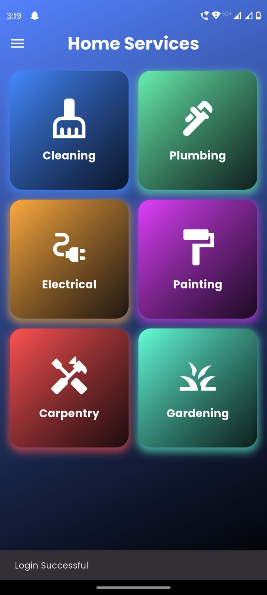
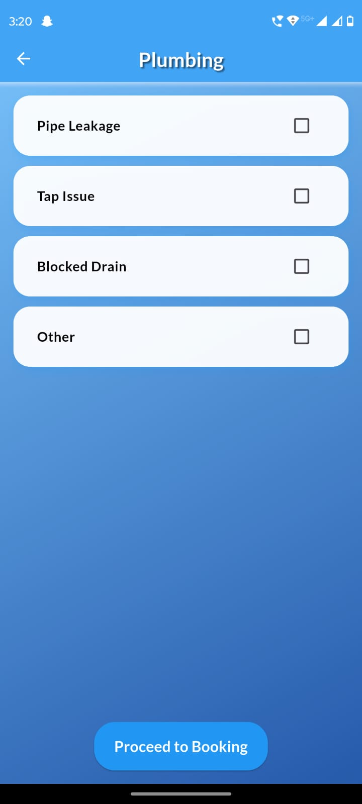
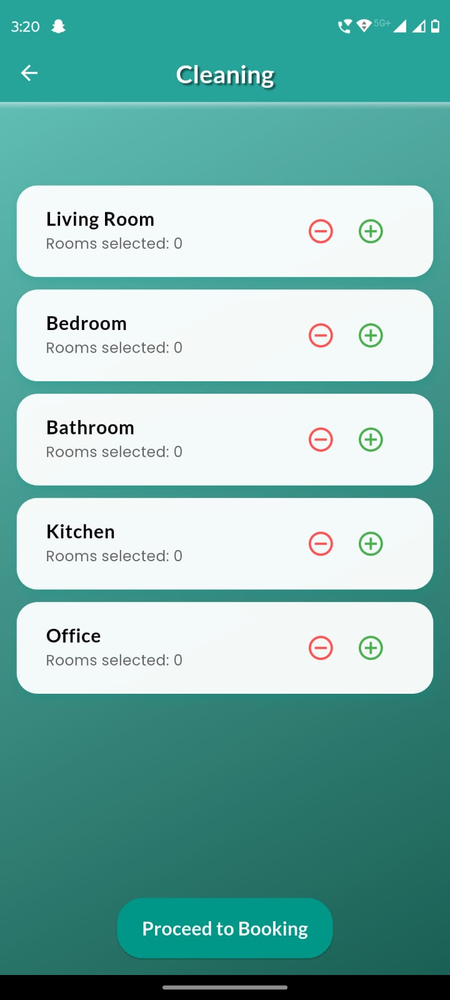
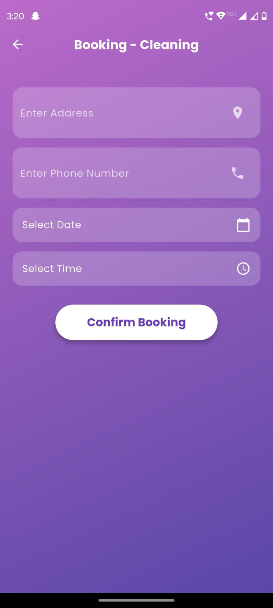
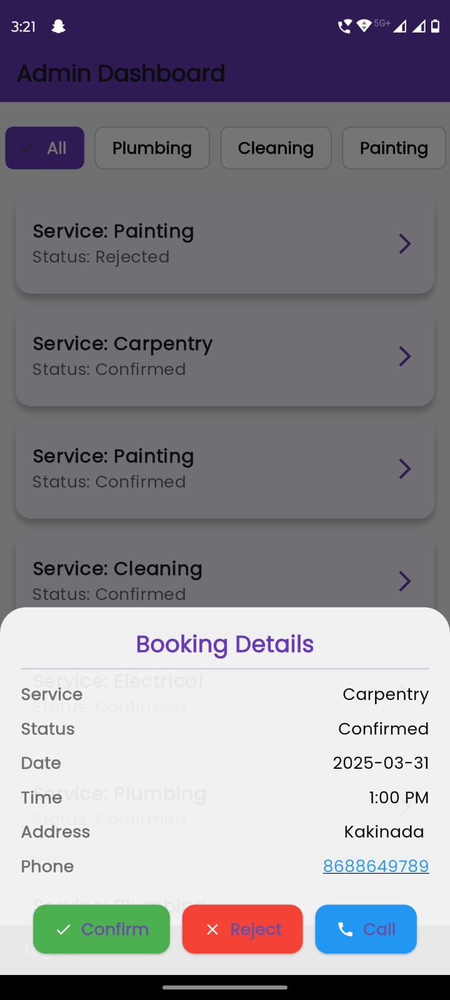

<h1 align="center">
  🏡 Home Services App
</h1>

<p align="center">
  <b>A Modern, Premium-Grade Flutter App for On-Demand Home Services</b><br/>
  Clean UI. Seamless UX. Admin Control. Built with Firebase & Google Maps.
</p>

<p align="center">
  
  
  
  
</p>

---

## ✨ Overview

> **Home Services App** is a sleek, professionally-designed Flutter application that lets users book essential home services with just a few taps. From room-wise cleaning to plumbing & painting, users can select service providers, schedule appointments, and track their bookings in real-time.

---

## 🧠 Features

| 🔐 Authentication  | Email & Password via Firebase               |
|--------------------|---------------------------------------------|
| 📂 Service Modules | Cleaning, Plumbing, Electrical, Painting   |
| 🏠 Room Selection  | Living Room, Bedroom, Bathroom, Kitchen    |
| 📍 Address Picker  | Google Maps Integration (Realtime)         |
| 📆 Date/Time       | Schedule bookings with ease                |
| 📋 Bookings        | View & track service status (Pending → Confirmed) |
| 🔧 Admin Panel     | Confirm / Reject / Call Users              |
| 📞 One-Tap Call    | Initiate a call to the customer instantly  |

---

## 🧱 Tech Stack

| Layer              | Tools / Services                            |
|-------------------|----------------------------------------------|
| UI                | Flutter 3.22, Dart                          |
| Backend/Auth      | Firebase Authentication & Realtime Database |
| Maps              | Google Maps API                             |
| State Management  | setState / Firebase StreamBuilder           |
| Deployment        | Android (Fully Tested)                      |

---

## 🎨 UI Showcase

> 💎 *Crafted with elegance, designed for user delight.*

<div align="center">

**🔐 Login Page**  


---

**🏠 Home Screen**  


---

**🧰 Choose a Service**  


---

**🛏️ Room Selection**  


---

**📍 Google Maps Address Picker**  


---

**🧾 Booking Summary**  


---

**📦 My Bookings**  


---

**🛠️ Admin Panel (Confirm / Reject / Call)**  


</div>

---

## 🧑‍💻 About the Developer

### Jegurupati Anantha Venkata Nurendra

| | |
|-|-------------------------|
📧 | [venkatanurendra@gmail.com](mailto:venkatanurendra@gmail.com)  
🔗 | [LinkedIn Profile](https://www.linkedin.com/in/nurendra-jegurupati-429b38232)  
💻 | [GitHub Portfolio](https://github.com/yourusername) <!-- Replace with actual username -->

---

## 🤝 Hire Me

I build premium-quality Flutter apps tailored for business needs.

> 💼 Available for Freelance, Startup MVPs & Custom Apps  
> 💬 Let’s build your next big idea. Drop me an [email](mailto:venkatanurendra@gmail.com) or connect on [LinkedIn](https://www.linkedin.com/in/nurendra-jegurupati-429b38232).

---

## 🚀 Getting Started

```bash
git clone https://github.com/yourusername/home-services-app.git
cd home-services-app
flutter pub get
flutter run
